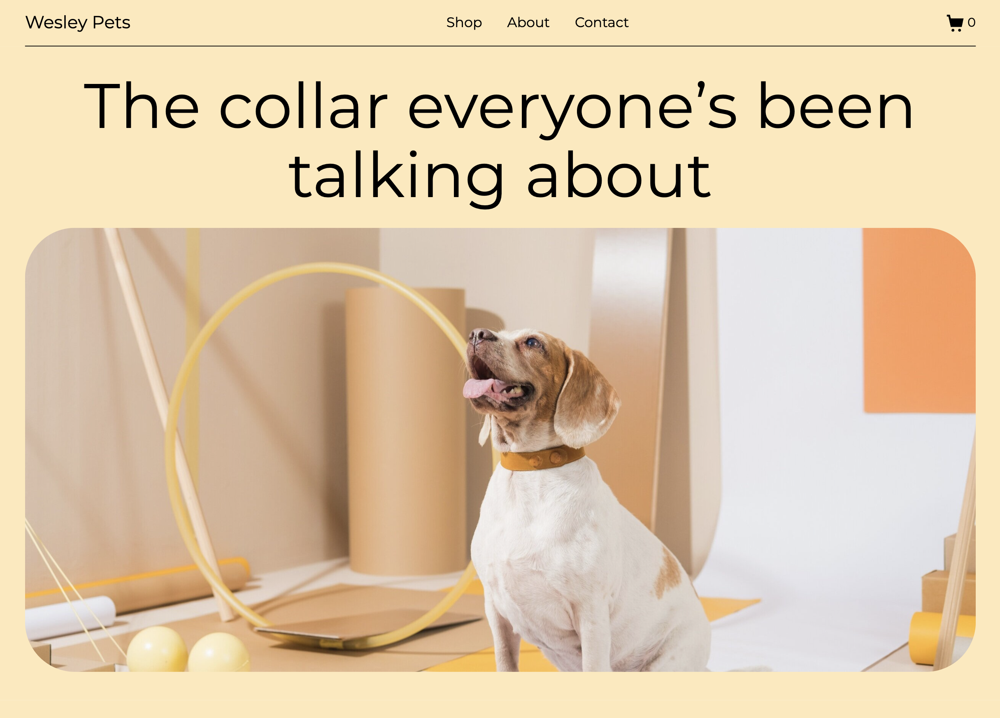
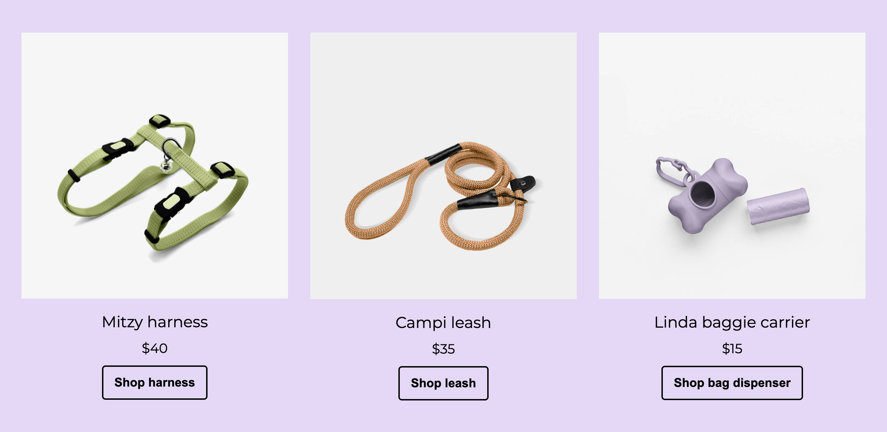

# Wesley Pets – HTML & CSS Responsive Website

This repository contains a responsive, multi-section landing page built with semantic HTML and modular CSS. The project emphasizes clean structure, scalable styling, and layout responsiveness across mobile, tablet, and desktop screens. It follows modern front-end practices, with a focus on maintainable code and foundational accessibility considerations.

## Project Overview

**Wesley Pets** is a static landing page for a fictional dog accessories brand. The site showcases core front-end development skills such as semantic HTML, modern CSS layout techniques, and mobile-first responsive design. It features structured sections including a hero area, featured products, and testimonials to highlight layout and UI capabilities.

## Key Features

- Semantic HTML5 structure with accessible, readable markup
- Mobile-first responsive design using media queries
- CSS Grid and Flexbox for flexible, adaptive layouts
- Modular, maintainable CSS with consistent class naming
- Relative and absolute positioning for overlay elements (e.g., buttons on images)
- Styled UI components, including responsive buttons and hover interactions

> This is a static front-end project with no interactive functionality or JavaScript. Buttons and forms are styled for layout and presentation purposes only.

## Technologies Used

- HTML5
- CSS3
- Google Fonts

## Screenshots

### Full Page (Desktop)


### Full Page (Mobile)


### Hero Section



### Featured Product (Hover)


### Product Gallery



## Getting Started

To preview the project locally:

1. Clone the repository:

   ```bash
   git clone https://github.com/JustinaVilcinskaite/wesley-pets-html-css.git
   ```

2. Navigate to the project directory:

   ```bash
   cd wesley-pets-html-css
   ```

3. Open `index.html` in your preferred web browser.

> This is a static front-end project. No build steps, installations, or dependencies are required.
